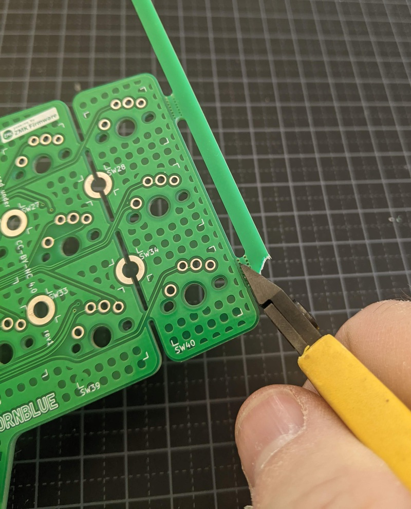
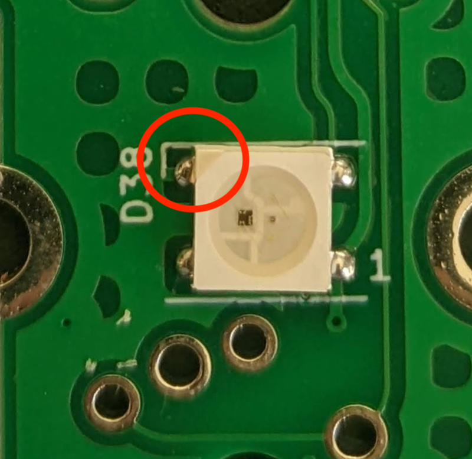
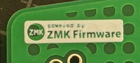
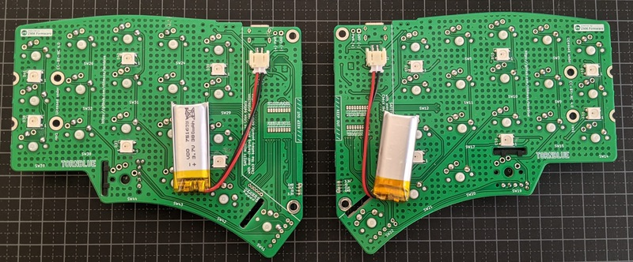

# Build Instructions

There are the build instructions for the Tornblue keyboard.

## PCBs

The PCBs have been ordered using PCBA, or PCB assembly. This means that most components have been installed during manufacturing.

There are some optional components that need to be hand soldered on the underside of the board, the JST-PH battery connector and underglow LEDs. You will also need to solder the keyswitches and optional roller encoders.

### Depanelization 

The left and right PCBs have been manufactured as a single panel. First you need to remove the breakaway tabs, to get a clean cut you can use wire cutters and a file (for example see this [PCB Depaneling](https://www.youtube.com/watch?v=NLKeF43AOBY&t=121s) video).

### 5 or 6 columns

If you are building a 5 column Tornblue keyboard you also need to break off the outer column.

### Underglow LEDs (optional)

The WS2812B 5050 leds need to be soldered in the **correct orientation**, on the underside of the board. There is a mark on one corner of the leds, this should be pointing to the top left of the PCB - next to the small vertical mark on the silkscreen. Carefully solder all six WS2812B leds.

### JST-PH connector (optional)

The JST-PH connector can be used for the battery connection, it is also possible to solder the battery with the through hole connectors near the USB port. **Do not connect the battery yet!**

The JST-PH connector is soldered on the underneath of the PCB.  The two pads towards the top of the board connect the battery, and the lower two pads are for mechanical support.

First apply some solder to one of the pads (as shown in the picture below). Reheat the solder and slide the JST-PH connector in place. Check the connector is correctly positioned, and adjust if required. Then solder the remaining three pads.

## Bootloader

If you bought boards directly from rtitmuss then bootloader is pre-programmed on the board. 

If you are using your own boards then you will need to program the bootloader yourself before installing ZMK. [See how to program the bootloader](./bootloader.md). 

## ZMK

You can now install zmk.

_The tornblue board configuration is not yet included in the zmk repo, you need to download zmk from https://github.com/rtitmuss/zmk_

#### Building with github actions

(todo)

#### Building on your PC

To build the firmware on your PC follow the [zmk installation instructions](https://zmk.dev/docs/development/setup).

You can build zmk for the left side of the keyboard using:

	west build -p -d build/tornblue_left -b tornblue_left -- -DZMK_CONFIG=/Users/richardt/keyboard/miryoku-zmk-config/config/

You can build zmk for the right side of the keyboard using:

	west build -p -d build/tornblue_right -b tornblue_right

### Install zmk

Connect the left side of the keyboard with USB. Press the reset button quickly twice. You should see a USB drive called `NRF52BOOT`. Copy the `zmk.uf2` from the `tornblue_left` build folder. zmk will be installed and the keyboard will restart.

Repeat this with the right side of the keyboard, but copy the `zmk.uf2` file from the `tornblue_right` build folder.

### Test

You can now test the PCBs. Power both sides of your keyboard to your PC with two USB cables Use tweezers or similar to short the key switch pads and test that all the keys work, on both sides of the keyboard. Note you don't need to pair the bluetooth yet the keycodes will be sent over USB.

## Key switches and battery

### Encoder (optional)

You can optionally use a Panasonic EVQWGD001 horizontal encoder. Position the encoder clip at an angle on the PCB, and carefully rotate it down. Solder the pins.

_ZMK currently only supports the encoder on the left side of the keyboard. A patch is needed to support encoders on both sides._

### Key switches

You can solder either Cherry MX compatible or Kailh Choc key switches. If you plan to use a plate remember to insert the key switches before soldering.

### Battery

If you are using the JSP PH connector you can now plug your battery on the underside of the PCB. **The red wire MUST connect to the positive terminal marked 'PWR (+)'**.

Alternatively you can solder the battery directly to the PCB using the through holes near the USB connector. **Be  very careful not to short the battery connectors.**

## Your finished

The PCB assembly if now complete. You can use one of the [case designs](./case/README.md), or make your own.

You can now use your new Bluetooth tornblue keyboard by pairing it with your PC, and customising zmk as required.

