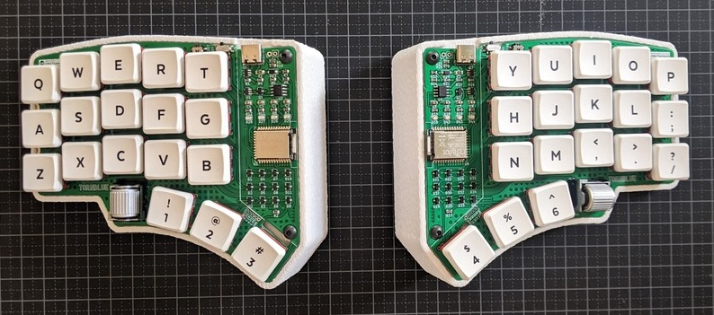
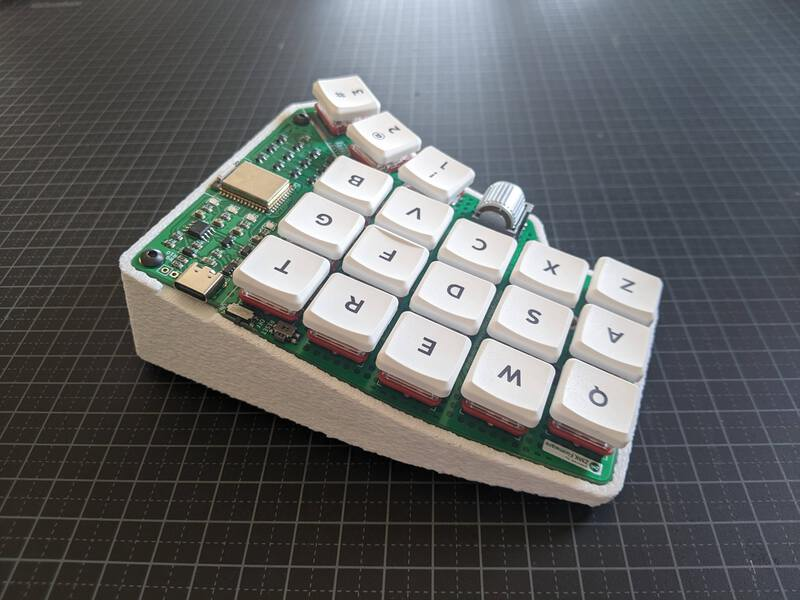
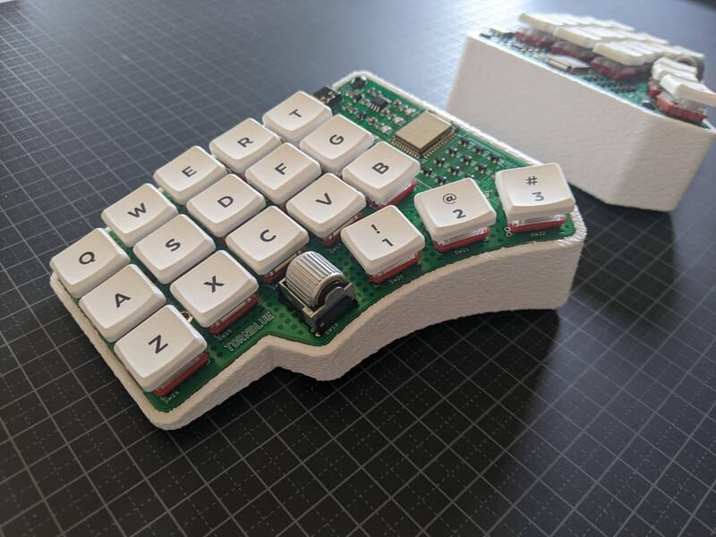

# Mini Wedge Case

This is a plateless wedge style case with a 14 degree angle for 5 column tornblue keyboards.

## 3d printing

### Case

You can 3d print a mini wedge case for your Tornblue using the follow files:

#### 5 column case
[Mini Wedge 5 column.3mf](Tornblue_Mini_Wedge_5col.3mf)

#### 6 column case
[Mini Wedge 6 column.3mf](Tornblue_Mini_Wedge_6col.3mf)

No supports are required for the base. Print the case as a mirror image for the right side. When the case has printed you need to add four M3 heat set inserts in the bottom of each half of the case. The prints below use a 'fuzzy skin' to add some texture to the sides of the case.

## Weights

You can optionally add up to 135g of weight in the bottom of the case. The case is designed to use car wheel balance weights, with sizes 10g: 23mm x 19mm. 5g: 12mm x 19mm. Height 4mm (including adhesive padding). For example: [US](https://www.amazon.com/Pit-Posse-Balancing-Weights-Adhesive/dp/B00OQWS98S/ref=sr_1_13?dchild=1&keywords=balancing+weight&qid=1620718949&sr=8-13), [UK](https://www.amazon.co.uk/FIERCE-CYCLE-Balance-Weights-Motorcycle/dp/B07QQ539GV/ref=sr_1_7?crid=7JSFKDWAYNL7&dchild=1&keywords=balancing+weights&qid=1620718843&sprefix=balancing+wei%2Caps%2C164&sr=8-7), [SE](https://www.amazon.se/gp/product/B01GHKG18G/ref=ppx_yo_dt_b_asin_image_o00_s00?ie=UTF8&psc=1).

## Assembly

Place the completed PCB on the base, taking care not to trap the battery cable. Use four 6mm M3 button head screws to attach the PCB to the base. Add adhesive feet to the underneath of the case.

Your keyboard is now finished, enjoy!

	

