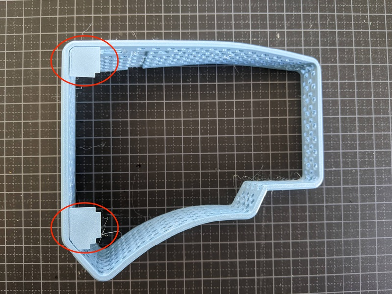
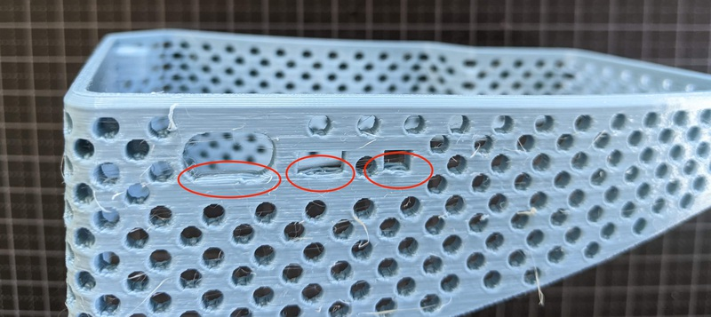
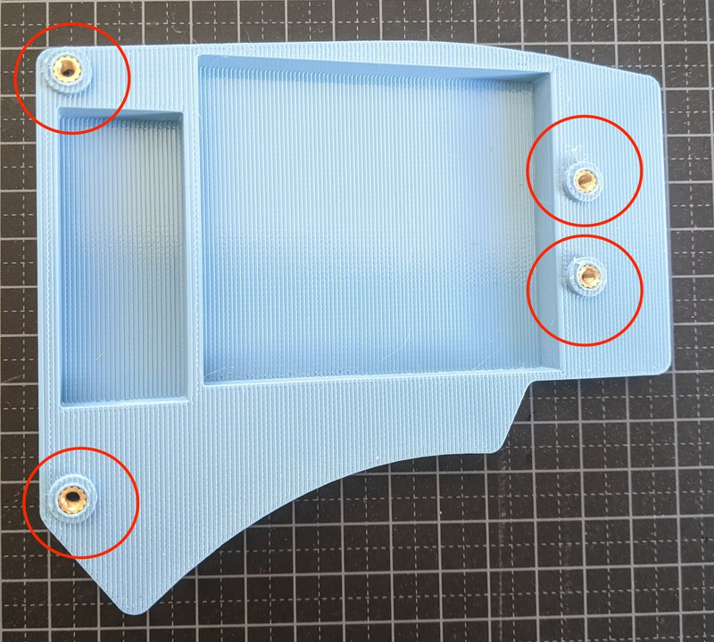
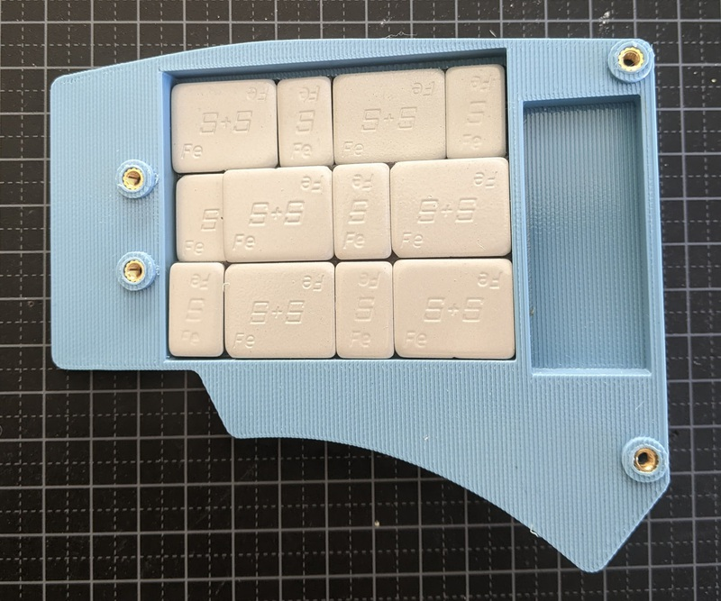
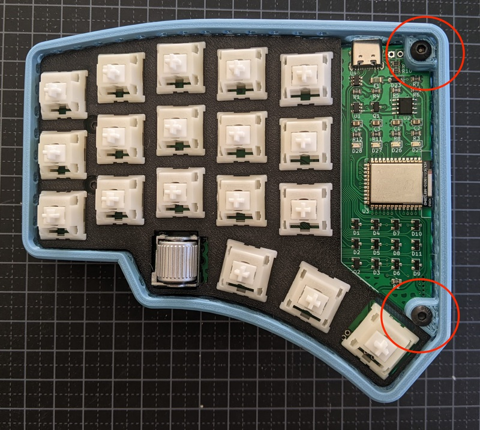
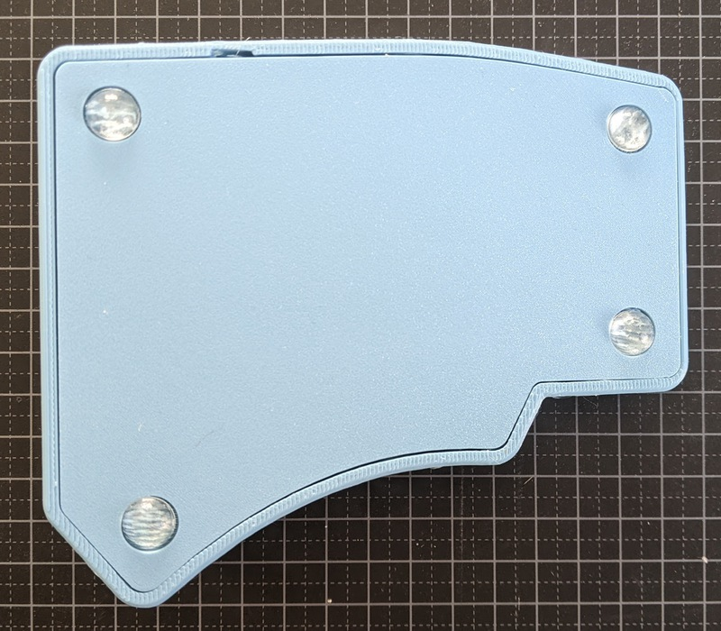
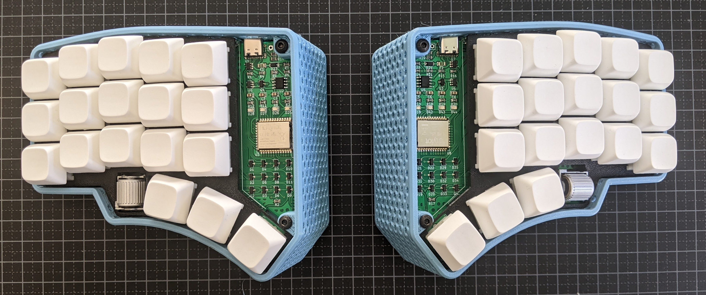

# 3d Printed Wedge Case

This is a wedge style case with a 14 degree angle for 5 column tornblue keyboards.

## 3d printing

### Plate

There is an optional 3d printable plate for MX switches. Remember to print and fit this before soldering your switches. The plate has cutouts for the roller encoder.

#### 5 column plate
[Wedge 5 column Plate.3mf](Tornblue_Wedge_5col_Plate.3mf)

#### 6 column plate
[Wedge 6 column Plate.3mf](Tornblue_Wedge_6col_Plate.3mf)

### Case

You can 3d print a wedge case for your Tornblue using the follow files:

No supports are required for the base.

The edge prints upside down so the visible surface is on the print bed. You need to print with supports.

#### 5 column case
[Wedge 5 column Base.3mf](Tornblue_Wedge_5col_Base.3mf)

[Wedge 5 column Edge.3mf](Tornblue_Wedge_5col_Edge.3mf)

#### 6 column case
[Wedge 6 column Base.3mf](Tornblue_Wedge_6col_Base.3mf)

[Wedge 6 column Edge.3mf](Tornblue_Wedge_6col_Edge.3mf)

## Post processing

You need to do some post processing on the case wall. Remove the support from the top of the case and clean up the bridging by the USB connector and switch holes. Give the case a good rub to remove any stray fibers.

Add four M3 heat set inserts in the bottom of each half of the case.

## Weights

You can optionally add up to 180g of weight in the bottom of the case. The case is designed to use car wheel balance weights, with sizes 10g: 23mm x 19mm. 5g: 12mm x 19mm. Height 4mm (including adhesive padding). For example: [US](https://www.amazon.com/Pit-Posse-Balancing-Weights-Adhesive/dp/B00OQWS98S/ref=sr_1_13?dchild=1&keywords=balancing+weight&qid=1620718949&sr=8-13), [UK](https://www.amazon.co.uk/FIERCE-CYCLE-Balance-Weights-Motorcycle/dp/B07QQ539GV/ref=sr_1_7?crid=7JSFKDWAYNL7&dchild=1&keywords=balancing+weights&qid=1620718843&sprefix=balancing+wei%2Caps%2C164&sr=8-7), [SE](https://www.amazon.se/gp/product/B01GHKG18G/ref=ppx_yo_dt_b_asin_image_o00_s00?ie=UTF8&psc=1).

## Assembly

Place the completed PCB on the base, taking care not to trap the battery cable. Use two 6mm M3 button head screws to attach the PCB to the base as shown below.

Carefully slide the case wall over the base. Check the clearance near the on/off switch. Use two 16mm M3 button head screws to swecure the top of the case.

Add adhesive feet to the underneath of the case.

Your keyboard is now finished, enjoy!

